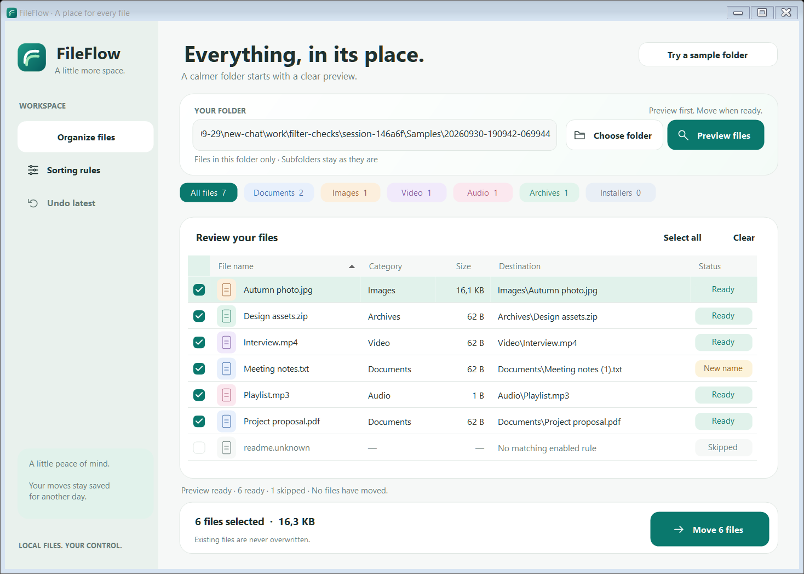
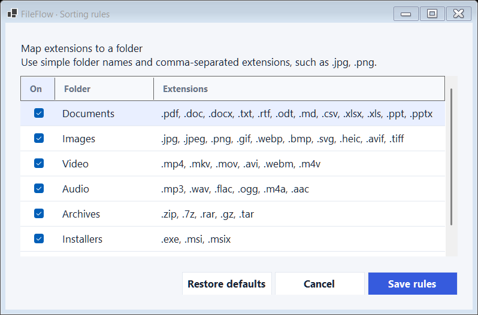

# Stillwater — FileFlow's visual language

Stillwater brings the quiet hierarchy and generous spacing of Apple desktop interfaces to a native Windows utility. FileFlow has its own identity: a pale sage sidebar, deep teal actions, a flowing two-stroke mark and pastel file categories. The implementation uses WinForms and vector drawing without a UI package.

## Palette and proportions

| Token | Value | Use |
| --- | --- | --- |
| Canvas | `#F6F8F7` | Main window background |
| Surface | `#FFFFFF` | Cards and secondary buttons |
| Sidebar | `#E9F1ED` | Persistent navigation |
| Ink | `#1F3130` | Primary copy |
| Muted | `#677B77` | Supporting copy |
| Accent | `#0A786D` | Primary actions and selected checkboxes |
| Accent soft | `#E1F2EB` | Selection and supporting surfaces |
| Border | `#E0E7E3` | Dividers and subtle outlines |

Main cards use a 20-unit radius, buttons 12, and status pills 8–10. Layout dimensions use a 96-DPI baseline. Typography uses Windows' Segoe UI: 24-point page headings, 18-point branding, 9.5–11-point controls and smaller secondary labels. Windows DPI scaling controls their displayed sizes.

Category colors add recognition while visible names carry the meaning: blue for documents, sand for images, lilac for video, rose for audio, mint for archives and blue-gray for installers. Status pills always include words such as **Ready**, **New name** and **Skipped**.

## Recognizable details

- The original mark is drawn from two curved paths inside a rounded teal square. `Branding.cs` generates the PNG and a Windows icon with 16, 24, 32, 48, 64, 128 and 256-pixel frames.
- The sidebar stays visually calm. The primary action is placed beside the content it acts on: preview next to the folder, move next to the selection summary.
- Source, review and action areas are separate rounded surfaces. The empty state uses the same stroke style as the navigation icons.
- Hover, pressed, disabled and keyboard-focus states are drawn by shared controls. No action depends on color alone.
- Category chips are buttons: a filled teal state marks the active filter, and All files restores the complete list. Move and bulk selection operate on the current view.
- The rule editor and confirmation dialog share the same spacing, type, corners and action treatment. Confirmation initially focuses **Cancel**.

## Windows behavior

`FlowForm` retains the native caption buttons, resizing, system menu and Snap behavior. On supported Windows 11 builds it requests rounded outer corners and matching caption colors through DWM. Other versions retain their system frame. Cards are opaque surfaces with a subtle gradient; there is no backdrop-blur requirement.

Buttons inherit from `Button`, the preview remains a `DataGridView`, and folder selection uses the system dialog. Shared colors fall back to Windows system colors when high contrast is active at launch. Full screen-reader, high-contrast and cross-monitor DPI certification has not been performed.

Custom buttons explicitly clear `ControlStyles.Opaque`, inherited from `ButtonBase`, so the framework paints the parent background before their rounded shape. Without that background pass, untouched parts of a reused graphics buffer can show stale labels or black corners. Pixel checks cover repainting buttons individually as well as rendering the complete forms.

The main forms establish their 96-DPI baseline after building the layout. Custom-painted geometry uses `DeviceDpi / 96f`. Runtime category chips also scale when created after a rule change. The local form harness checks workflows and produces full and compact snapshots at the active Windows scale; the committed snapshots were reviewed at 125%.

## Reuse across future apps

`Theme.cs` owns the palette and shared drawing helpers. `FlowControls.cs` owns buttons, surfaces and stroke icons. `FlowForm.cs` owns Windows frame treatment. These form the reusable foundation; a future application can choose its own mark and accent while retaining the same spacing, focus treatment and control behavior. The components are currently internal to FileFlow rather than a separately published design-system package.

